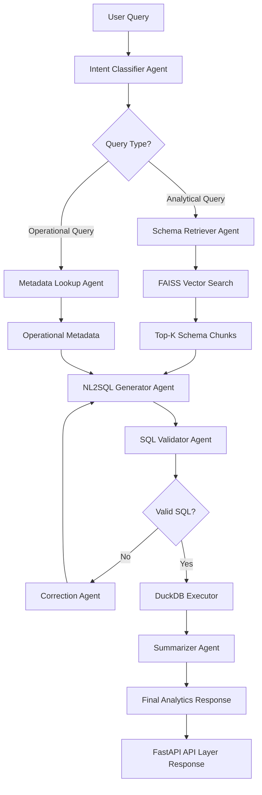

<h1 align="center">👋 Hi, I'm Sourabh Gupta</h1>
<h3 align="center">Senior Python Developer | AI Engineer | Agentic Systems Architect | Backend & DevOps | Cloud Practitioner</h3>

  
  <!--  -->
  
  
  <!--  -->
  <!--  -->

## 🧑‍💻 About Me

I am a **Python Developer & AI Automation Engineer** with hands-on experience building **agentic workflows**, **multi-agent NL2SQL systems**, **AI-assisted DevOps**, and **end-to-end backend architectures** deployed in enterprise environments.

My specialization is in **LLM-driven automation systems**, where I combine:
- Multi-agent reasoning  
- RAG pipelines  
- Vector search (FAISS, Chroma)  
- High-performance FastAPI microservices  
- DuckDB + Parquet Lakehouses  
- AWS cloud infrastructure  
- DevOps automation (CI/CD, Docker, Jenkins)

I have operational experience delivering **production-grade enterprise AI solutions** for global clients across USA, Singapore & India.

---

## 🚀 Technical Expertise Summary

**Core Skills**
- Python (FastAPI, Django, Flask)
- Data Engineering (DuckDB, Parquet, ETL)
- Agentic AI (LangChain, LangGraph, Multi-Agent)
- RAG Systems (Embeddings, FAISS, Chroma, Hybrid Search)
- LLM Orchestration (OpenAI, Gemini, Ollama)
- Backend Microservices (REST APIs, Async, SQLModel)
- DevOps (Docker, Jenkins, CI/CD Pipelines, GitHub Actions)
- Cloud (AWS EC2, Lambda, S3, VPC, ECS, IAM)
- Databases (MySQL, PostgreSQL, MongoDB, Redis, DynamoDB)
- Automation (SDK-driven scripts, network automation, workflow engines)

**Strength Areas**
- End-to-end system architecture  
- Multi-layer enterprise automation  
- High scalability backend design  
- Secure & confidential LLM deployment  
- Observability + structured logging  
- Performance optimization  

## 🛠 Tech Stack

  
   
  

  
  
  
  
  
  

  
  
  
  
  
  

## 🔥 Featured GitHub Projects

### 🧠 Multi-Agent Analytics Gateway (MAAG)
**Tech:** FastAPI, LangChain, LangGraph, FAISS, DuckDB, Parquet, OpenAI, Ollama  
**Repo:** *[(Github/SourabhGupta/MAAG)](https://github.com/SourabhGuptaGit/Multi-Agent-Analytics-Gateway)*

- Built a **multi-agent NL2SQL system** turning natural language queries into validated SQL  
- Designed a **Lakehouse architecture** using Parquet + DuckDB capable of scaling beyond **100GB**  
- Embedded schema & table metadata into **FAISS vectors** for instant lookup  
- Created a **safety engine** to verify & optimize SQL queries  
- Delivered API responses with **p95 < 250ms** latency  

**Workflow**

### 🧠 MAAG – Multi-Agent NL2SQL Workflow Diagram

Below is the end-to-end reasoning flow of the **multi-agent NL2SQL pipeline**, visualized using Mermaid.

---

### ⚙️ Network Automation & Agentic Reasoning Platform
**Tech:** FastAPI, LangChain, LangGraph, Redis, PostgreSQL, Docker, Jenkins, Ollama  

<b>Repo:</b> 

- Converted multi-vendor network CLI workflows into a **secure backend API platform**  
- Implemented **agentic LLM-based reasoning** to:  
  - Extract routing insights  
  - Detect config deltas  
  - Generate compliance summaries  
- Ingested live device metadata + logs into Redis & PostgreSQL  
- Used **on-prem LLM inference via Ollama** for confidential data  
- Deployed fully on AWS with containerized microservices  

---

### 📊 Engineering Analytics & Developer Productivity Suite
**Tech:** Django, MySQL, SQLAlchemy, LangChain, RAG, Docker  

<b>Repo:</b> 

- Aggregated Jira, Bitbucket & Jenkins events  
- Built dashboards for real-time developer insights  
- Implemented RAG for PR summarization & CI/CD failure detection  
- Added automated daily email updates with AI-generated summaries  
- Containerized the system with Docker  

---

### 🛠 Python API + Data Automation Toolkit
**Tech:** Python, Pandas, SMTP, FastAPI, Redis, Jenkins

<b>Repo:</b> 

- Automated Excel & CSV generation pipelines  
- Integrated multiple REST APIs for enterprise reporting  
- Added email automation with templated summaries  
- Replaced up to **70–80%** of manual operational processes  

---

## 🏢 End-to-End Enterprise Projects Delivered

### 🇸🇬 Prudential (Singapore) — Agentic Network Automation Platform  
- Multi-agent LLM abstraction over complex network operations  
- Config interpretation, routing insights & compliance analysis  
- Secure on-prem LLM execution using **Ollama**  
- Metadata ingestion from SDKs & multi-vendor devices  

---

### 🇺🇸 General Motors (USA) — Engineering Analytics & Dev Productivity  
- CI/CD failures summarization using LLMs  
- PR-level insights & engineering metrics  
- Automated dashboards using Django  
- Daily email alerts with AI summaries  

---

### 🇺🇸 WhyGrene – MAAG: Multi-Agent Analytics Gateway  
- Fully automated analytics system  
- NL → SQL agentic reasoning  
- FAISS + DuckDB lakehouse  
- Multi-LLM execution pipeline  

---

### 🇮🇳 People Tech – Automation Systems  
- SCA violation analysis  
- CI diagnostics automation  
- Daily test execution & AI-based classification  

---

### 🇮🇳 PureSoftware — Backend AI & DevOps  
- FastAPI microservices with structured logging  
- Jenkins CI/CD pipelines  
- Secure LLM integration  
- Network intelligence platform  

---

## 📈 Weekly Activity

  

---

## 🔮 What I'm Learning Now

- Multi-agent orchestration patterns  
- Advanced RAG (hybrid search, hierarchical routing)  
- High-throughput FastAPI microservices  
- AWS Lambda-based automation workflows  
- Distributed system design  

---

## 📨 Connect With Me

  
  
  

---

## ⭐ Final Notes
This README represents my journey building **AI-powered automation**, **multi-agent systems**, and **enterprise-grade backend platforms**.  
I continuously improve my craft by designing systems that are:
- ✔ Reliable
- ✔ Scalable
- ✔ Multi-agent aware
- ✔ Cloud native
- ✔ Secure
- ✔ Observable
- ✔ Built with clean engineering discipline

If you want to discuss systems, automation, agentic workflows, or backend engineering — feel free to reach out!
